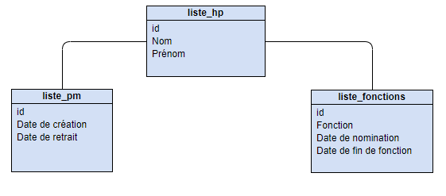

# Projet Java
Antoine JULIEN

## Mise en marche 
Projet Maven en java 9. Application console, il n'y a pas de check pour toutes les entrées utilisateurs je suppose que vous savez lire. 

<u>Date intéréssante à tester:</u> 12/05/1981, le gouvernement est dissous le 13 mai 1981 il faut attendre le 21 mai pour en avoir un nouveau.

## Fonctionalitées
Voici une liste succincte de toutes les fonctionnalités de mon programme:
 - Simuler la vie politique au jour par jour
 - Voir l'état du paysage politique à une date particulière
 - Choisir des options à partir d'un menu affiché
 - Trouver l'historique des nominations d'une personne
 - Trouver le gouvernement actif pour une date donnée (som premier ministre et ses ministres)
 - Charger l'ensemble des hommes politiques de la V et IV république
 - Trouver le président de la république pour une date donnée
 - Elire un président
 - Renvoyer un président
 - Nommer un ministre
 - Dissoudre un gouvernement
 - Créer un gouvernement 

## Les données
> *Je dédicace ce projet à la secrétaire qui a rentré toutes les données à la main*

J'ai utilisé la [source de donnée](https://www.data.gouv.fr/fr/datasets/liste-alphabetique-des-ministres-de-la-liberation-a-la-veme-republique/) indiqué dans l'énoncé du projet. J'utilise [opencsv](http://opencsv.sourceforge.net/) pour lire les fichiers csv. 
**Je tiens à faire remarquer** que les données sont de médiocre qualité. 

De plus au fil du temps et des gouvernements les fonctions sont fusionnés, supprimés, renommés. J'ai répertorié l'ensemble des fonctions différentes dans le fichier [differentes_fonctions](src/data/differentes_fonctions) (Pandas utilisé avec commande `unique()`). Cela m'empêche  donc de gérer certaines fonctionnalités (comme, par l'exemple, l'historique d'un ministère). 

### Traitement des données
Afin de faciliter l'utilisation des données dans mon application, je les ai traitées, découpées et reformées (j'ai utilisé python avec sa puissante librairie pandas). Mes données suivent le schéma suivant:

    
Avec 
- `liste_hp` l'ensemble des hommes politiques.  
- `liste_fonction` les fonctions de chaques politiciens, délémités temporellement.  
- `liste_pm` la liste de tous les premiers ministres.
Les données se trouvent dans le dossier src/data/.  

Dans le but de garder un déroulement réaliste des événements, j'ai choisi de conserver l'ensemble des données fournies par le gouvernement. Cependant, cela pose plusieurs problèmes notamment au niveau de la gestion de l'historique des différentes entités. De plus il n'est pas possible d'effectuer certaines actions, mais toutes les classes ont les méthodes/attributs nécessaires pour effectuer les traitements demandés.

## Perspectives  
 
Je vais effectuer une liste des points qui pourraient être améliorés dans l'application:
 1. Une simplifiaction du système de ministères. Garder les ministères principaux afin d'avoir un meilleur suivi au fil du temps.
 2. Utilisation d'un SGBD pour faciliter l'accès aux données. Java possède plusieurs API pour accéder à des sources de données comme JDBC. 
 3. Changer la façon dont je traite le temps. Actuellement chaque jour je parcours toutes les données pour voir si il y a un changement, l'utilisation de HashSet et de HashMap m'empèche d'avoir des doublons. Cependant ce n'est pas une solution optimale. J'ai pensé à associer pour chaque homme politique une chronologie d'événénements. Plus simplement une meilleure gestion des données pourrait améliorer pas mal de choses.
 4. Passer de l'application console à un GUI.